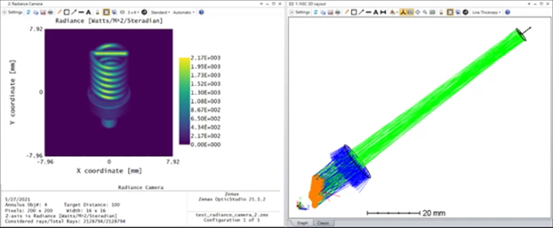

# API (CS User Analysis): Non-Sequential Radiance Camera

## Overview

This tool calculate radiance or luminance (brightness) of objects seen by human eyes.

Language - CS

## Author
Michael Cheng

## Download
<table>

<tr>

<th>Date</th>

<th>Version</th>

<th>OpticStudio Version</th>

<th>Comment</th>

<tr>

<tr>
<td>2021/05/27</td>

<td>1.0</td>

<td>21.2</td>

<td>Creation<td>
<tr>
<td>2021/06/03</td>

<td>1.1</td>

<td>21.2</td>

<td> Add function to export text files <td>
<tr>
<td>2021/06/11</td>

<td>1.2</td>

<td>21.2</td>

<td> Bug Fix <td>
<tr>
<td>2021/04/16</td>

<td>1.3</td>

<td>22.1</td>

<td> Bug fix when showing luminance data <td>
<tr>

<td>2021/04/19</td>

<td>1.4</td>

<td>22.1</td>

<td> Bug fix. Now the extension file name is no restricted to lower case. <td>
<tr>