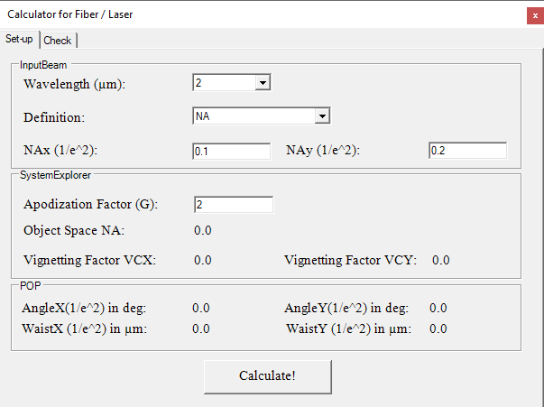
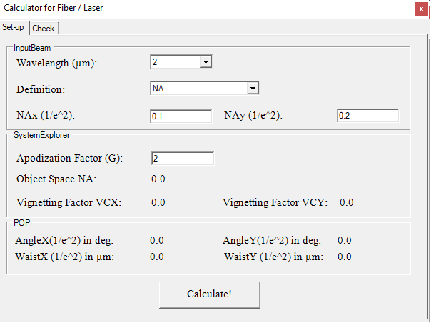
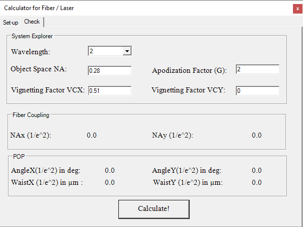

# Sequential Fiber Laser Calculator

## Overview

This Zemax User-Extension helps set-up or check a system with fibers or lasers in OpticStudio. There are two tabs: one to set-up correctly the system explorer given the fiber values and a second tab to check that a system has been set-up correctly. Values are also given for POP.

Language - CS
Plugin Type - API Extension

## Author
Sandrine Auriol

## Instructions

#### 1. Installation
To install the Zemax User Plugin, copy the .exe file under {Zemax}\ZOS-API\Extensions.
OpticStudio will have to be restarted to be able to view the newly installed Zemax User Plugin.

#### 2. How to use
To use the Zemax User plugin, open a sequential file.
Go to Programming Tab…User Extension and select the Zemax Plugin.
In the Set-up tab:

Once you press Calculate, the tool will calculate the values to define in the System Explorer and in POP.
In the Check tab:

Once you press Calculate, the tool will report the fiber NAx and Nay at 1/e^2 the values in POP.