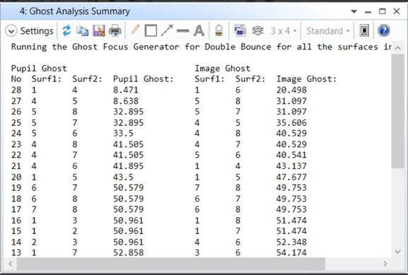

# API (CS User Analysis): Sequential Ghost Analysis Summary

## Overview

This User Analysis runs the Ghost Focus Generator in Double Bounce and sorts the combination of surfaces that contribute to the worst Pupil and Image Ghosts.

Language - CS

## Author
Sandrine Auriol

## Download

<table>

<tr>

<th>Date</th>

<th>Version</th>

<th>OpticStudio Version</th>

<th>Comment</th>

<tr>

<tr>
<td>2019/11/27</td>

<td>1.0</td>

<td>19.8</td>

<td>Creation<td>
<tr>
<td>2022/03/30</td>

<td>2.0</td>

<td>22.1.2</td>

<td> Change the iteration of surfaces as some combinations where missed. All combinations are now checked and if pupil ghost or image ghost = 0 the data is removed. 
<tr>