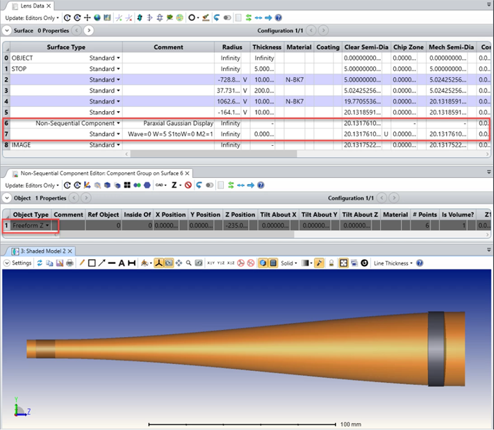

# API (CS User Analysis): Sequential Ghost Analysis Summary

## Overview

This Zemax User-Extension displays the envelope of a Gaussian Beam. The Gaussian Beam characteristics are calculated by the Paraxial Gaussian Beam calculator. The extension adds a Non-Sequential Component at the bottom of the sequential editor. A Freeform Z object is added to the Non-Sequential Component Editor. It is formed with the different sizes of the beam calculated by the Paraxial Gaussian Beam

Language - CS

## Author
Sandrine Auriol

## Download

<table>

<tr>

<th>Date</th>

<th>Version</th>

<th>OpticStudio Version</th>

<th>Comment</th>

<tr>

<tr>
<td>2020/03/24</td>

<td>1.0</td>

<td>20.1.1</td>

<td>Creation<td>
<tr>
