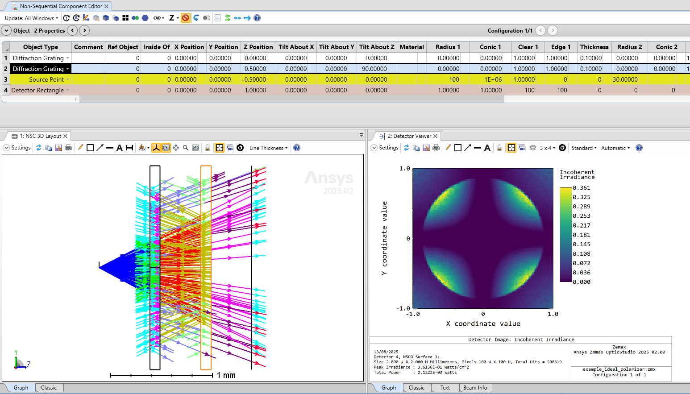
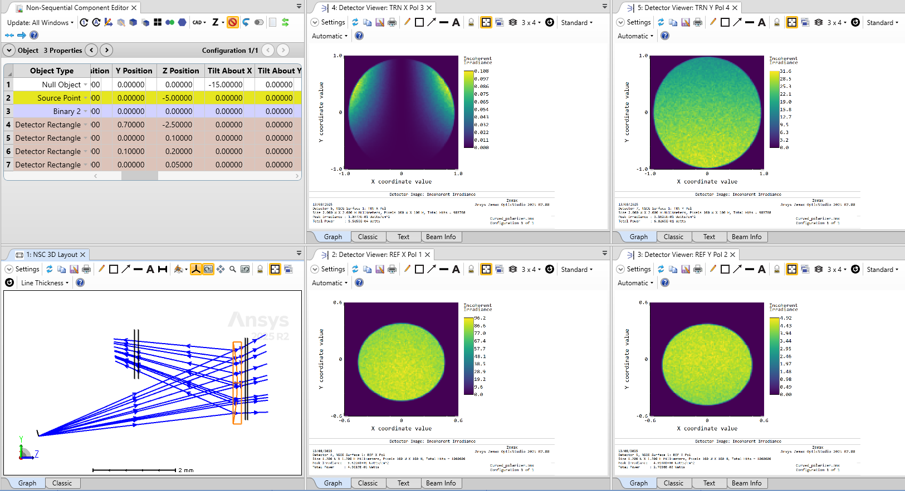

# Non-paraxial Linear Y Idealized Polarizer 

## Overview

This diffractive DLL models a non-paraxial idealized polarizer that produces a linear polarized transverse electric field. It is an alternative to the Jones matrix, that model polarizers for paraxial fields under normal incidence. This non-paraxial idealized polarizer model supports reflection as well as transmission, material changes (i.e. refraction is considered), and support curved surfaces too.

The diffractive DLL is only a tool used here to compute the electric field. 

For more information, check the following article:
S. Zhang, H. Partanen, C. Hellmann, and F. Wyrowski. Non-paraxial idealized polarizer model. Optics Express, 26(8):9840-9849 (2018).
https://opg.optica.org/oe/fulltext.cfm?uri=oe-26-8-9840&id=385354

## Source Language
C++

## Author
Michael Cheng

## Instructions

#### 1. Installation
Copy the compiled DLLs into the *Zemax\DLL\Diffractive* folder.

The DLL is also contained in the example Zemax files, so opening the *example_ideal_polarizer.zprj* or the *Curved_polarizer.zprj* files will copy the DLL into the *Zemax\DLL\Diffractive* folder too.

#### 2. How to use
**Idealized Polarizer**
- Open the attached *example_ideal_polarizer.zprj* file
- The second polarizers on *Objects 2* is roteated by 90 degrees compared to the first polarizer on *Object 1* by the *Tilt About Z* parameter.
- The model correctly provides the following typical cross pattern when two polarizers are crossed and the beam is slightly diverging.

**Curved Polarizer**
- Open the attached *Curved_polarizer.zprj* file
- The polarizer is located on the *Binary 2* object, which has a curved front surface.
- The model supports reflection and refraction, as well as curved surfaces.

