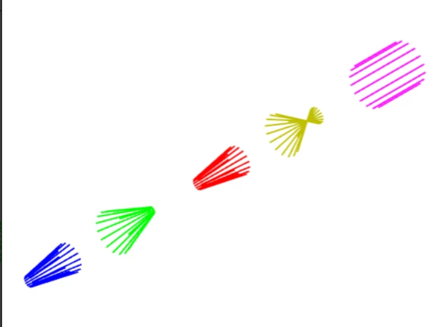

# DLL (Source): Non-sequential fan and ring sources

## Overview

For both radiometric analysis (for example determining the power incident on a detector) and optimization, the best choice for a source is almost always a pseudo-random source such as a Source Ellipse, with enough analysis rays to provide for smooth statistics. Frequently, this means tens of thousands to millions of rays. For visualization, OpticStudio provides the capability to designate a lesser number of Layout Rays to appear in layout plots. These layout rays are still randomly distributed. If only a few rays are used, they generally do not well represent the design. If enough rays are used to visualize the extent of the volume occupied by rays, then the plot can become crowded.

As a solution to this problem, the accompanying DLL files provide the ability to generate, in non-sequential mode, uniform fans and rings of rays similar to those which can be displayed in sequential mode layouts. They are compiled for a Windows 64-bit platform.

YFAN.DLL is a source dll which, when installed in the appropriate directory, can be used to generate a fan of rays. RING.DLL is a source dll which, when installed in the appropriate directory, can be used to generate a ring of rays. Each can be installed automatically by opening the ZAR file provided as a demonstration.

The attached ZIP file contains the dll files as well as the C++ source code for each dll. It also includes an explanation of the code and instructions for using each dll, written in the format of a knowledge base article. For each dll, there is a ZAR file which implements examples of its use. Opening the ZAR will also install  the dll in the correct Zemax directory.

## Source Language
C++

## Author
David

<table>

<tr>

<th>Date</th>

<th>Version</th>

<th>OpticStudio Version</th>

<th>Comment</th>

<tr>

<tr>
<td>2019/12/11</td>

<td>1.0</td>

<td>19.8</td>

<td>Creation<td>
