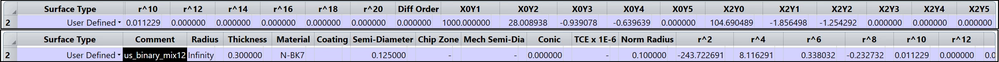
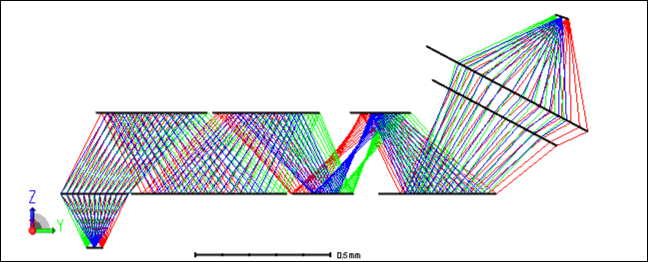

# Binary 1 + 2 mix

## Overview

This DLL provides a User Defined Surface that has planar a substrate and a phase profile integrating both radial polynomials and extended *X/Y* polynomials. It can be considered as a combination of the *Binary 1* and *Binary 2* surfaces, but with only planar substrate. This kind of phase profile definition is useful for metalens design.

## Source Language
C++

## Author
Michael Cheng

## Instructions

#### 1. Installation
Copy the compiled DLL into the *Zemax\DLL\Surfaces* folder.

The DLL is also contained in the example Zemax file, so opening the *Binary2_mix12_demo.zprj* file will copy the DLL into the correct *Zemax\DLL\Surfaces* folder too.

#### 2. How to use

To use the DLL, open a sequential Zemax file in which you would like to use the *Binary 1+2 mix* surface. Change the surface type to *User Defined* and select the *us_binary_mix12.dll*.

The parameters specific to this DLL are: the normalization radius (*Norm Radius*), even radial phase terms up to order 20 ($r^2$, $r^4$, $r^6$, ... $r^{20}$), diffraction order (*Diff Order*), Extended X/Y polynomial phase terms (*X0Y1*, *X0Y2*, *X0Y3*, ... *X6Y4, *X6Y5*), pamater power mode (*Par. Pow. Mode*), and custom power (*Custom Pow.*).

Further information about the application of such a phase surface is discussed in the *How to design DOE lens or metalens in OpticStudio* knowledgebase article:

https://optics.ansys.com/hc/en-us/articles/42661666194323-How-to-design-DOE-lens-or-metalens-in-OpticStudio