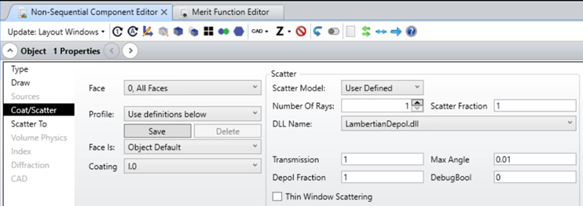

# DLL (Surface Scatter) Non-sequential Spline scatter

## Overview

This Surface Scatter DLL models a Lambertian scattering and contains a depolarization fraction parameter to depolarize part of the scattered rays. That DLL is a good example to demonstrate how to control the electric field and how to implement importance sampling. The code is based on "{Zemax}\DLL\SurfaceScatter\Lambertian.DLL".

## Author
Michael Cheng 

## Download

<table>

<tr>

<th>Date</th>

<th>Version</th>

<th>OpticStudio Version</th>

<th>Comment</th>

<tr>

<tr>
<td>2019/01/13</td>

<td>1.0</td>

<td> - </td>

<td>Creation<td>
<tr>