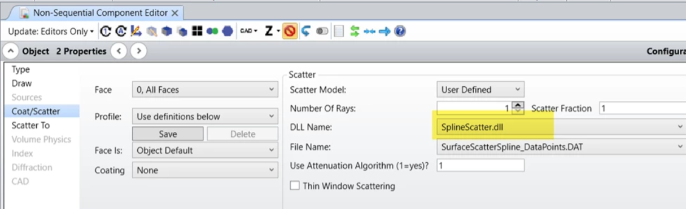
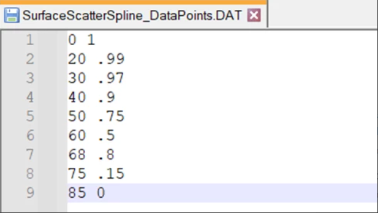

# DLL (Surface Scatter) Non-sequential Spline scatter

## Overview

This Surface Scatter DLL uses an external data file with spline fit points to generate a rotationally symmetric spline-fit scatter function. Allows for quick/easy custom scatter definitions to be implemented. Spline function is defined via polar angle (with theta=0 centered on the specular ray). External data file consists only of 2 columns: polar angle, and relative radiance.

## Author
Zachary Derocher 

## Download

<table>

<tr>

<th>Date</th>

<th>Version</th>

<th>OpticStudio Version</th>

<th>Comment</th>

<tr>

<tr>
<td>2020/01/15</td>

<td>1.0</td>

<td> - </td>

<td>Creation<td>
<tr>