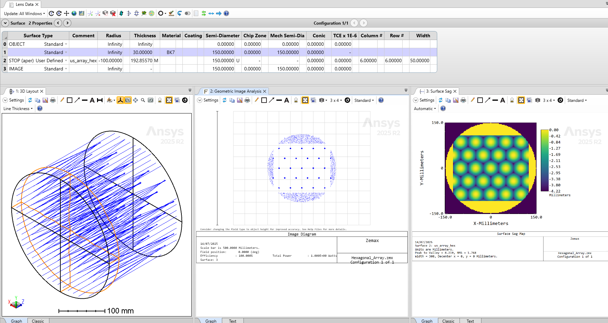
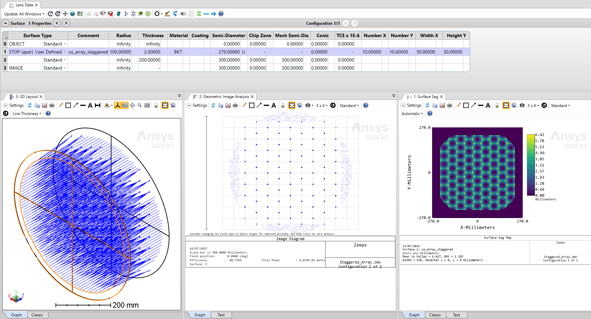

# Hexagonal and Staggered Lens Array

## Overview

These two User Defined Surface DLLs create an array of hexagonal arranged lenses and an array of staggered lenses.

The source code is based on the *us_array.c* example, whcih is shipped with the OpticStudio installation files in the *\Zemax\DLL\Surfaces* folder. The *us_array_hex.dll* User Defined Surface has 3 parameters: the number of lenses in X and Y direction (*Column #* and *Row #*) and the width of each lens. The us_array_staggered.dll surface has 4 parameters: the number of lenses in X and Y direction (*Numer X* and *Number Y*), and the width and hieght of the lens (*Width X* and *Height Y*).

## Source Language
C++

## Author
Michael Cheng

## Instructions

#### 1. Installation
Copy the compiled DLLs into the *Zemax\DLL\Surfaces* folder.

The DLLs are also contained in the example Zemax files, so opening the Hexagonal_Array.zprj and Staggered_Array.zprj files will copy the DLLs into the *Zemax\DLL\Surfaces* folder too.

#### 2. How to use
**Hexagonal Lens Array:**
- Open the attached *Hexagonal_Array.zprj* file
- Surface 2 is a *User Defined Surface* with an array of hexagonal arranged lenses.
- The parameters specific to this DLL are: *Column #*, *Row #*, and *Width*, where *Width* is the width of one lenslet.

**Staggered Lens Array:**
- Open the attached *Staggered_Array.zprj* file
- Surface 1 is a *User Defined Surface* with an array of staggered lenses.
- The parameters specific to this DLL are: *Number X*, *Number Y*, *Width X*, and *Height Y*, where *Width X* and *Height Y* give the size of one lenslet.

