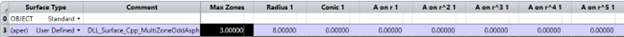

# Multi Zone Odd Asphere

## Overview

This User-Defined Surface DLL models a series of annular aspheric zones. Each zone has its own radius, conic constant, asphere coefficients up to order 12 (including both even and odd terms), and a maximum radial aperture for the zone. Up to 15 concentric zones are supported, and each zone is shifted so that the surface is continuous across the zone boundaries. It is similar to the built-in *us_multi_zone_asphere.dll* in OpticStudio, but enables both even and odd aspheric terms.

## Source Language
C++

## Author
Csilla Timar-Fulep

## Instructions

#### 1. Installation
To install the User Defined Surface DLL, copy the compiled .dll file to the Documents\Zemax\DLL\Surfaces folder. OpticStudio will have to be restarted to be able to use the DLL.

The DLL_Surface_Cpp_MultiZoneOddAsphere.dll is also contained in the MoltiZoneOddAsphere.zprj demo file, so opening the file will copy the DLL into the Zemax\DLL\Surfaces folder too.

#### 2. How to use
To use the DLL, open a sequential Zemax file in which you would like to use the MultiZoneOddAsphere surface. Change the surface type to User Defined and select the DLL.

