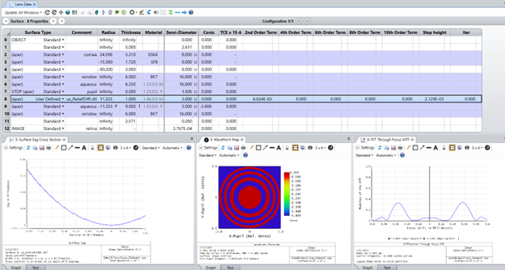
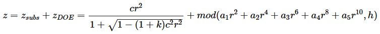

# Relief-Type Diffractive Surface

## Overview

This User-Defined Surface DLL provides a realistic model for relief-type diffractive lenses based on zone-decomposition. Using zone-decomposition, diffraction into multiple orders can be accurately considered at once, and this method inherently accounts for wavelength dispersion and diffraction efficiency by modeling the actual shape of the diffractive element. Application examples include the creation of advanced intraocular lens (IOL) models, where the different orders are designed to provide sharp vision for multiple viewing distances, thereby substituting accommodation of the natural crystalline lens. 

This DLL applies a simple rotationally symmetric diffractive structure with a uniform relief step height, added on top of a Standard surface representing the substrate. To enable model comparison with built-in OpticStudio solutions, the relief shape is described by Even Asphere polynomials. Accordingly, the surface sag is given by the following equation:

In the above equation, *mod* represents the modulo function, $c$ is the curvature, i.e. the reciprocal of the radius, $k$ is the conic constant, $r$ is the radial coordinate, and $h$ is the uniform relief step height.

The $a_i$ coefficients of the Even Asphere polynomials, the $h$ step height, and the propagation algorithm indicator ($Iter$ parameter) are first defined under *Case 1*, Parameter column header names, in the source code of the DLL. Then, *Case 3* is used to describe the surface sag based on the above equation for drawing purposes in the layout plots. *Case 4* should account for paraxial ray trace results, but since diffraction analysis is required on top of ray tracing for the zone-decomposition approach, which is only available for real ray trace, this step is ignored. This means that in paraxial approximation the model behaves as a Standard surface. Finally, under *Case 5*, the real ray trace results are computed. For real ray trace, there are two solutions implemented, an approximative analytic approach used in case of $Iter=0$, and an iterative algorithm used when $Iter\neq 0$.

For more details about IOL design using this User Defined Surface DLL, please take a look at the "Realistic modeling of relief-type diffractive intraocular lenses using User-Defined Surface DLLs" knowledgebase article.

## Source Language
C++

## Author
Csilla Timar-Fulep

## Instructions

#### 1. Installation
To install the User Defined Surface DLL, copy the compiled .dll file to the Documents\Zemax\DLL\Surfaces folder. OpticStudio will have to be restarted to be able to use the DLL.

The us_ReliefDiffr.dll is also contained in the Ideal_Bifocal_Lens_ISOmodel.zprj demo file, so opening the file will copy the DLL into the Zemax\DLL\Surfaces folder too.

#### 2. How to use
To use the DLL, open a sequential Zemax file in which you would like to use the relief-type diffractive surface. Change the surface type to User Defined and select the DLL.

