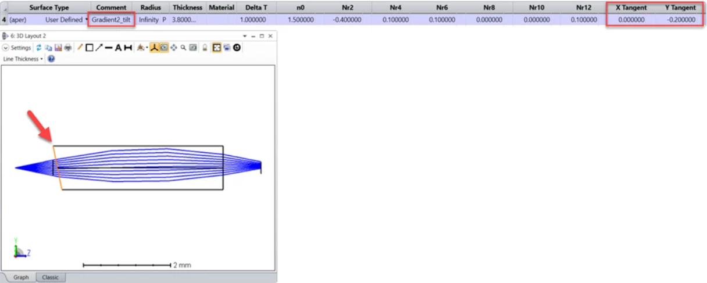

# DLL (User-Defined Surface): Sequential Gradient2 Tilted

## Overview

This user-defined surface can be used to model a tilted gradient 2 surface like a cleaved multi-mode fiber. Compared to the gradient 2 surface, this surface contains 2 additional parameters for the tilt. 

## Author
Sandrine Auriol

## Download

<table>

<tr>

<th>Date</th>

<th>Version</th>

<th>OpticStudio Version</th>

<th>Comment</th>

<tr>

<tr>
<td>2021/12/09</td>

<td>1.0</td>

<td> - </td>

<td>Creation<td>
<tr>