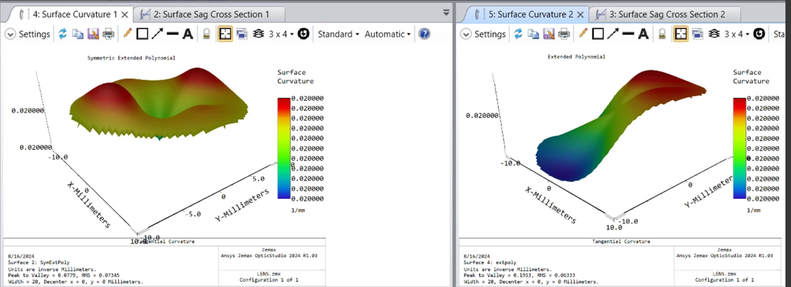

# Symmetric Extended Polynomial Surface DLL

## Overview

This DLL creates a surface identical to the Extended Polynomial surface, but it allows the user to specify if symmetry should be enforced upon the surface, specifically in the x direction, y direction, x & y direction, or no symmetry (identical to the typical Extended Polynomial surface).

The source code is not shared.

Comparison of Symmetric Extended Polynomial (x & y symmetry active) vs standard Extended Polynomial 

## Author
Dominique 'Nikki' Galvez

## Download

<table>

<tr>

<th>Date</th>

<th>Version</th>

<th>OpticStudio Version</th>

<th>Comment</th>

<tr>

<tr>
<td>2024/08/15</td>

<td>1.0</td>

<td> 24.2 </td>

<td> - <td>
<tr>
