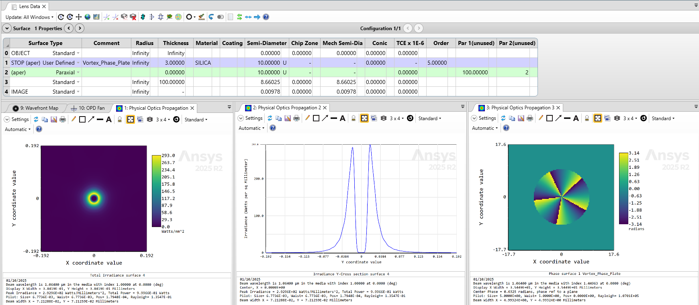
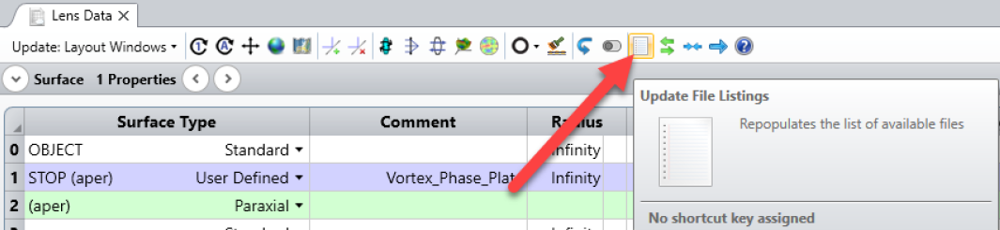
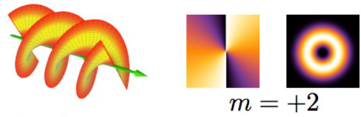
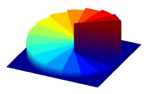
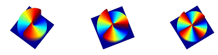
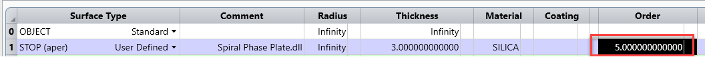

# Vortex Phase Plate

## Overview

This DLL models a Vortex Phase Plate. It is useful in laser applications to convert a Gaussian laser beam into a donut-shaped energy ring. 

For more information, check the following links:

http://212.199.42.26/Diffractive_optics_Applications/vortex_zemax_tutorial.pdf

https://www.holoor.co.il/application/optical-vortex-phase-plate-application-notes/

https://www.holoor.co.il/optical-calculator/vortex-lenses/

## Source Language
C++

## Author
Michael Cheng

## Instructions

#### 1. Installation
To install the DLL, open the attached project archive file.

An alternative option is to copy manually the DLL under the *\Zemax\DLL\Surface* folder. Then, click on this icon to refresh the list of DLLs:

The source code is also attached for reference.

#### 2. How to use

To use the DLL, open the attached file. It models a vortex phase plate with $M = +5$.

**What is a Vortex phase plate?**

An optical vortex is a zero of an optical field, so a beam that shows a zero in it is an optical vortex. See: https://en.wikipedia.org/wiki/Optical_vortex. 
A vortex phase plate will twist light around its axis of travel. Because of the twisting, the light waves at the axis itself cancel each other out.

A Vortex phase plate can be needed in laser applications to convert a gaussian beam to a donut-shaped energy ring, for example in solar coronagraphs, high-resolution microscopy, optical tweezers for particle trapping & manipulation, lithography, quantum optics.
For more information see: 

https://www.holoor.co.il/application/optical-vortex-phase-plate-application-notes/

**How does it work?**

The vortex phase plate is composed of spiral phase to control the phase of the transmitted beam. The total etching depth from the top to bottom of “staircase” is a function of the design wavelength and the substrate’s optical index.

The topological charge, denoted in the relevant literature as *M*, refers to the number of $2\pi$ cycles (i.e. “staircases”) that are etched around $360\degree$ turn of diffractive surface. In the following image, one “staircase” cycle covers entire $360\degree$ turn of surface, so $M=1$ for that vortex phase plate.

Below the surface profiles are illustrated for optical Vortex phase plate with $M=2$, $M=3$, and $M=4$.

**How to model it in OpticStudio?**

We can use a user-defined surface with one parameter *M*, which is the order.

OpticStudio models the diffractive power as a phase profile on the surface. Rays are bent by the gradient of the phase profile introduced by the diffractive.

The phase $\phi$ in radians adds to the optical path length of the ray:

$$OpticalPath = OpticalPath + \dfrac{\lambda}{2\pi}\phi$$

The gradient of the phase profile (phase slope) change the direction of rays:

$$l' = l + \dfrac{\lambda}{2\pi}\dfrac{\partial \phi}{\partial x}$$
$$m' = m + \dfrac{\lambda}{2\pi}\dfrac{\partial \phi}{\partial y}$$

where *l* is the *x*-direction cosine of the ray and *m* is the *y*-direction cosine of the ray.

More details about diffractive surfaces in OpticStudio can be found in this knowledgebase article:
https://optics.ansys.com/hc/en-us/articles/42661739263251-How-diffractive-surfaces-are-modeled-in-OpticStudio

First, we calculate the angle in the quadrant: 
$$\phi = atan2(x/y)*M$$

For example if $M=5$, the phase will be equal to $2\pi$ for an angle of $2\pi/5$.

$$Wavenumber = 2\pi/ \lambda$$

$$OpticalPath = \phi / (Wavenumber / n)$$

Then we need to give the derivative of the phase in the dll:

$$ dpdx = -y / (x^2+y^2) * M$$

$$dpdy = -x/ (x^2+y^2) * M$$

And finally the direction cosines are:

$$l' = l * n1 + dpdx / wavnum / n2$$

$$m’ = m * n1 + dpdy / wavnum / n2$$

The OpticStudio model can be checked here:
https://www.holoor.co.il/optical-calculator/vortex-lenses/

**Extra comments about the OpticStudio model**

On the paraxial lens, OPD Mode is set to 2.

OPD Mode = 2 assumes that the lens is used at infinite conjugates regardless of the actual conjugates. This option will return incorrect results if the incoming beam is not reasonably collimated.

OPD Mode = 1 does not work well with the vortex phase, but there should be no problem with real lenses.