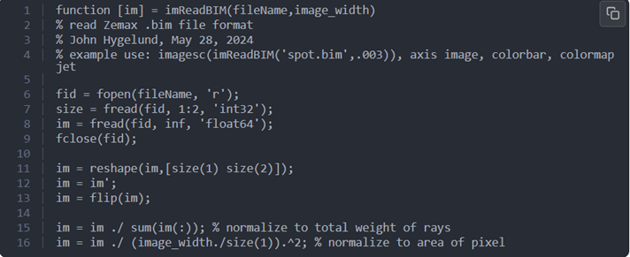
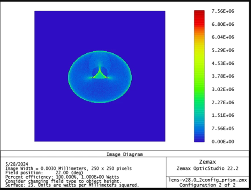
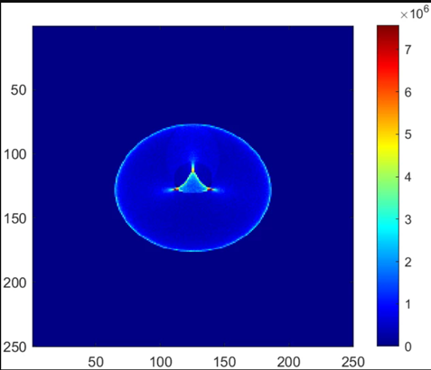

# Matlab function to read .bim files

## Author

John Hygelund

## Overview

Below is a simple function to read .bim files into matlab

The inputs are the .bim file name and image width

This was written to consume the output from 'Geometric Image Analysis'.

Values are consistent with units displayed in zemax as long as the Total Watts = 1

