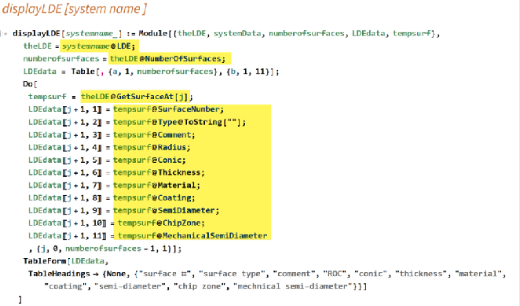

# Mathematical API code to display the Lens Data Editor (LDE)

## Author

Eri Elliott

## Overview

Here is my most-used chunk of API code, which reads and displays the basic information in the Lens Data Editor (LDE). 

I've highlighted the parts of this that are API code, which can easily be translated into other languages. (See the linked article below.)  Everything not highlighted is specific to Mathematica, so one would need to find the equivalent functions, etc., in Python, Matlab, etc

https://community.zemax.com/code%2Dexchange%2D10/a%2Dnote%2Don%2Dconverting%2Dapi%2Dcode%2Dbetween%2Dpython%2Dmatlab%2Dand%2Dmathematica%2D5496