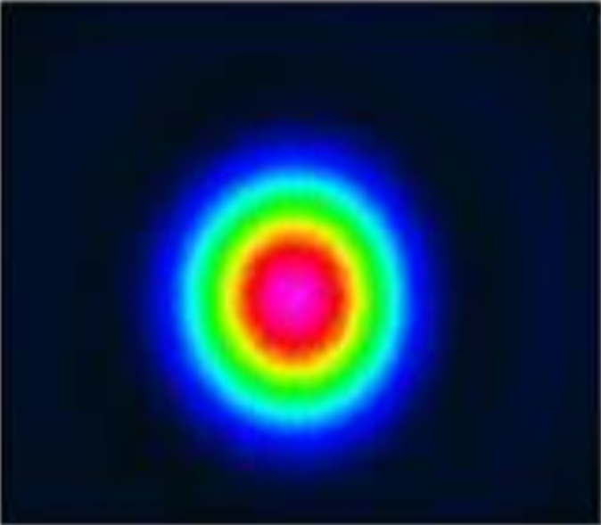

# Converting Image to ZBF

## Overview

This Python converter reads an image file and converts it into a ZBF file. The image is used for the amplitude of the electric fields. The phase of the electric fields is set to zero. 

Note that the conversion may not work properly for color images depending on the color scheme. Convert your image to a grey scale before the conversion

## Author
Sandrine Auriol

## Instructions

#### 1. Installation

The Python script is ready to be used as part of file pre-/post-processing. 

#### 2. How to use
1. Open the Python code in the preferred IDE.
2. Update the INPUTS FROM USER section with custom parameters for file names and paths, beam array size, wavelength, and output ZBF type (text or binary).
3. Run the attached *Converting_Image_ZBF.py* python code.
4. A message will indicate that the ZBF file has been created. After generating the file, please make sure to copy the ZBF file to your *\Documents\Zemax\POP\BEAMFILES* folder. Alternatively, you can change the output file path to your current BEAMFILES folder under the INPUTS FRMO USER section.
