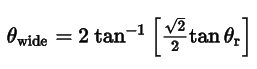
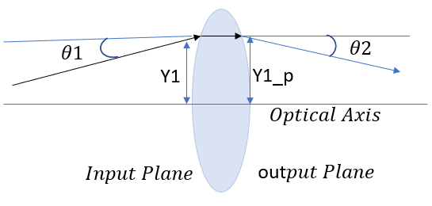

# Calculate the Ray Transfer (ABCD) Matrix for Thick Lens

## Overview

To compute the ABCD ray transfer matrix, OpticStudio traces rays over a very small region centered upon the reference field position. Usually, this is the center of the field of view. OpticStudio allows selection of which field position to use for reference. By default, OpticStudio sets the corner of the field grid in object space to be at the maximum radial field distance. Because object height is linear with the tangent of the field angle, the full width of the field when angles are used to define the field is given by

where θr is the maximum radial field angle at the corner of the field.

The ray coordinates in image space for the very small field of view are used to determine the ABCD matrix components. The use of an ABCD matrix allows for coordinate rotations. If the image surface is rotated, such that a y object coordinate images to both an x and a y image coordinate, the ABCD matrix will automatically account for the rotation. The grid distortion plot shows the linear grid, and then marks the actual chief ray intercept for a ray with the same linear field coordinates with an "X" for each point on the grid.

In OpticStudio, we can calculate the Ray transfer (ABCD) matrix using ZOS-API. We can calculate ray transfer matrix element by knowing the height of the incidenct ray, height of the refracted ray, angle of incidence, and angle of refraction. As we have PARY or PAXY operands for showing the height of the ray in X or Y coordinates respectively, and PATY shows the tangent of the angle the paraxial ray makes in the Y-Z plane after refraction, we can calculate the metrics shown in the below.

In ray transfer (ABCD) matrix analysis, an optical element a thick lens gives a transformation between (Y1, θ1) at the input plane and (Y1_p, θ2) when the ray arrives at the output plane.
 
We can export the angle of incidence and angle of refraction using PATY Operand and height of incidenct ray and height of refracted ray using PARY in the YZ Plane to a variable. Using these values we can calculate the A,B,C and D Values for the Ray Transfer Matrix.

## Author
Sahil Rajan

## Instructions

#### 1. Installation
The Python script is ready to be used. No installation is required.

#### 2. How to use
Open the attached Zemax file, set OpticStudio to wait for Interactive Extension connection, and run the Python script to calculate the ABCD ray transfer matrix.
