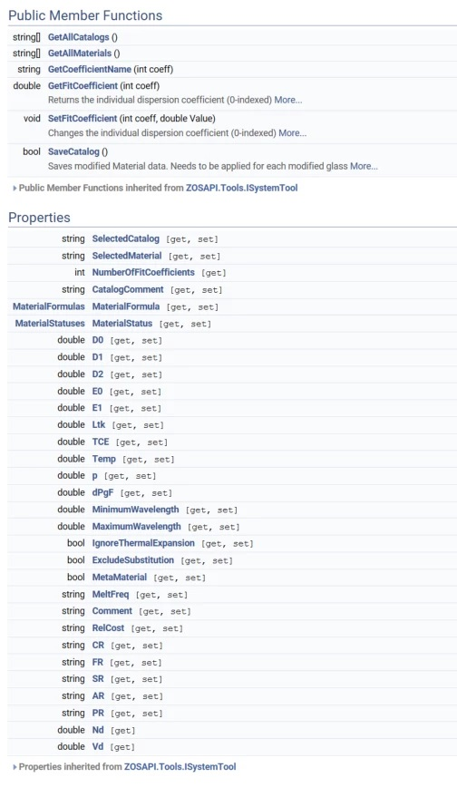

# ZOS-API Material Catalog Search Examples

## Overview

This repository contains Python examples demonstrating how to use the **Zemax OpticStudio ZOS-API Material Catalog interface** to programmatically search optical materials based on their supported wavelength ranges.

These examples illustrate how to:
- Query materials within a single catalog (e.g., SCHOTT)
- Extend the search across all available material catalogs

The Material Catalog interface was introduced relatively recently in the ZOS-API and provides a more efficient and less tedious alternative to manual catalog inspection.

---
## Author

**Alexandra Culler** 

## Instructions

#### 1. Installation
The Python script is ready to be used in interactive mode 

#### 2. How to use
Open a Zemax file, set OpticStudio to wait for Interactive Extension connection, and run the Python script.
