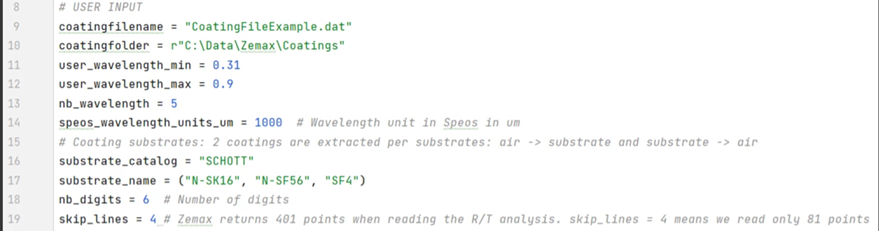

# Python: Zemax to SPEOS coating converter

## Overview

 This example is a Python script to convert Zemax coatings to Speos coatings. The script is available here.

https://github.com/ansys/optical-automation/blob/main/ansys_optical_automation/application/example_convert_coating_zemax_to_speos.py

The user inputs are:

For each coating + substrate, the software will create a Speos coating. Then the script will combine the two Speos coatings into a .bsdf180 file. The script is using the Transmission vs Angle analysis from OpticStudio.

For more information about Ansys optical_automation, click link (https://community.zemax.com/code-exchange-10/ansys-open-project-on-github-3456)

## Author
Sandrine Auriol

