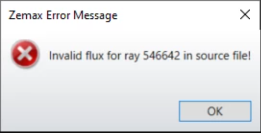

# Python: Source File - fixing error with zero flux

## Overview

This Python script will read the binary source file and will try to fix any errors related to zero-flux rays.

## Author
Michael Cheng

## Download

<table>

<tr>

<th>Date</th>

<th>Version</th>

<th>OpticStudio Version</th>

<th>Comment</th>

<tr>

<tr>
<td>2022/01/01</td>

<td>1.0</td>

<td> - </td>

<td>Creation<td>
<tr>

