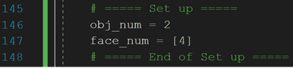
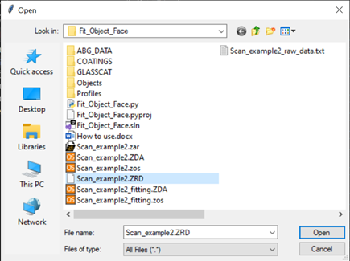
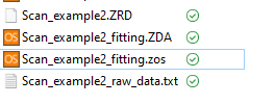
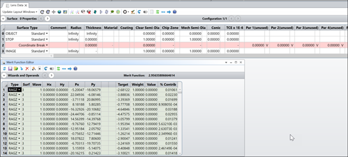

# Python fit object face (ex. for CAD)

## Overview

Attached file shows alternative method to the following code.(https://community.zemax.com/code-exchange-10/zpl-macro-fit-cad-surface-as-a-sequential-surface-2423)

It uses ZOS-API with Python. The benefit is we will generate the fitting system automatically. 

A document is provided to show a simple example about how to use it.

## Author
Michael Cheng

## How to use

1. Open a new Non-sequential mode system and import your CAD file without any material.

2. Set up a source that can completely hit all faces (can be multiple) on the specified object you want to detect. Save ZRD file.

Tip:
Open Scan_example2.zar for an example.

3. Open Python code "Fit_Object_Face.py". Do not run it yet at this step.

4. Set the object and face that you want to fit in the code as shown below.

5. Run the code.
* Note you will need numpy and matplotlib installed in order to run this code.
A window like below will show. Just select the ZRD you want to analyze.

6. The tool will export a Zemax system (.zos) as well as a raw data text file (.txt) for reference. The text file is only for user's reference and is not used in any further place. The zos file is generated for users to perform an optimization to fit for a surface form they need. See next step to know how to use this .zos file.

7. Open the generated zos file and you can see it’s ready for optimization. You just need to change the image surface to the correct surface type you want to fit, set the related parameters as variables. And then you can optimize to fit the surface.

Note a Coordinate Break surface has been built with 4 variables (Decenter X/Y, Tilt About X/Y) for removing any potential tilting and decenter during optimization. If this is not desired, users can turn the variables off before optimization.