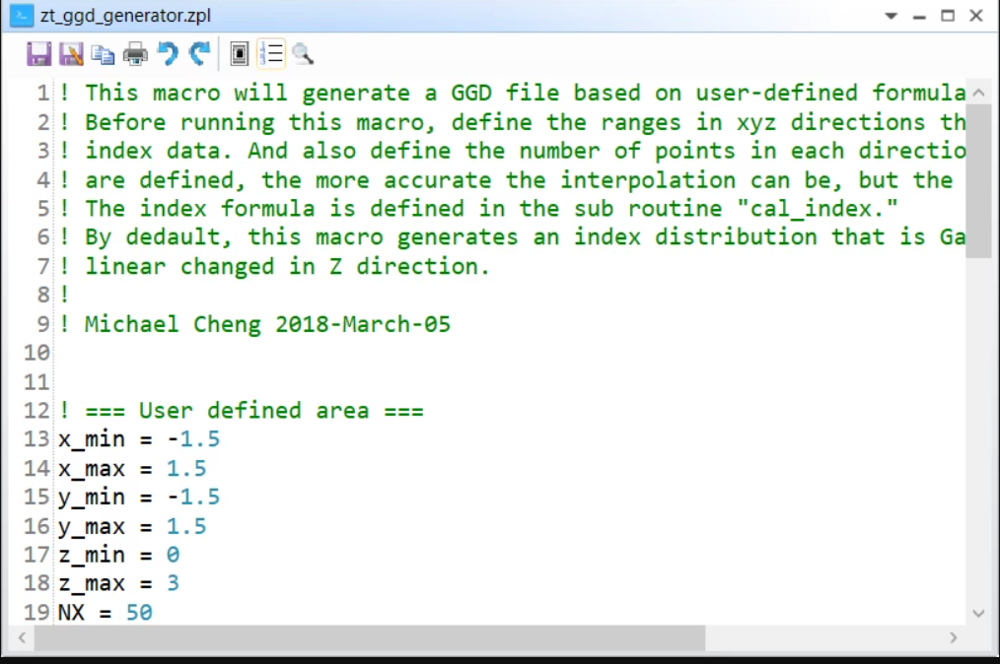

# ZPL Macro: Create a GGD (Grid Gradient) file

## Overview

This macro will generate a GGD file based on user-defined formula. Before running this macro, define the ranges in xyz directions that you want to generate index data. And also define the number of points in each directions. The more the points are defined, the more accurate the interpolation can be, but the slow the simulation is. The index formula is defined in the sub routine "cal_index.". By default, this macro generates an index distribution that is Gaussian in XY-plane and linear changed in Z direction.

## Author

Michael Cheng

## Download

<table>

<tr>

<th>Date</th>

<th>Version</th>

<th>OpticStudio Version</th>

<th>Comment</th>

<tr>

<tr>
<td>2018/03/05</td>

<td>1.0</td>

<td> - </td>

<td>Creation<td>
<tr>
