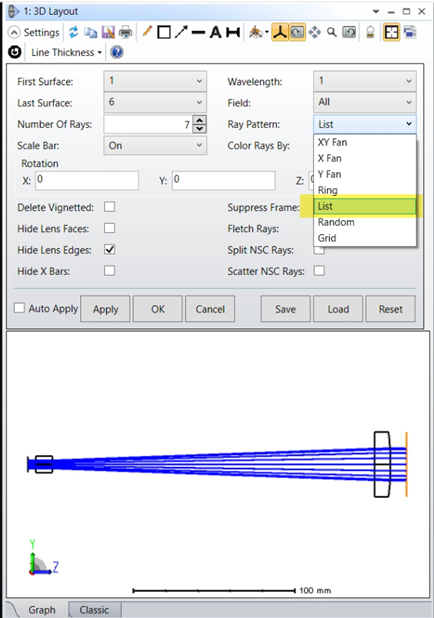

# ZPL Macro: ZPL Macro: RayList Gaussian Beam Visualizer

## Overview

This ZPL macro generates a file under "\Zemax\Miscellaneous\RAYLIST.TXT" to represent the envelope of a Gaussian beam. There are 3 user inputs: the Waist Size w0, Surf 1 to Waist and the M2 Factor. The macro generates a list of 16 rays based on Paul Colbourne's skew rays: Using skew rays to model Gaussian beams. These rays can be displayed in the 3D layout or Shaded Model by selecting under the settings Pattern...List. 

## Author

Michae Humphreys

## Language
ZPL

## Download
<table>

<tr>

<th>Date</th>

<th>Version</th>

<th>OpticStudio Version</th>

<th>Comment</th>

<tr>

<tr>
<td>2021/07/23</td>

<td>2.0</td>

<td> - </td>

<td>Added the definable variables as input<td>
<tr>
<td>2021/04/01</td>

<td>1.0</td>

<td> - </td>

<td>Creation<td>
<tr>

