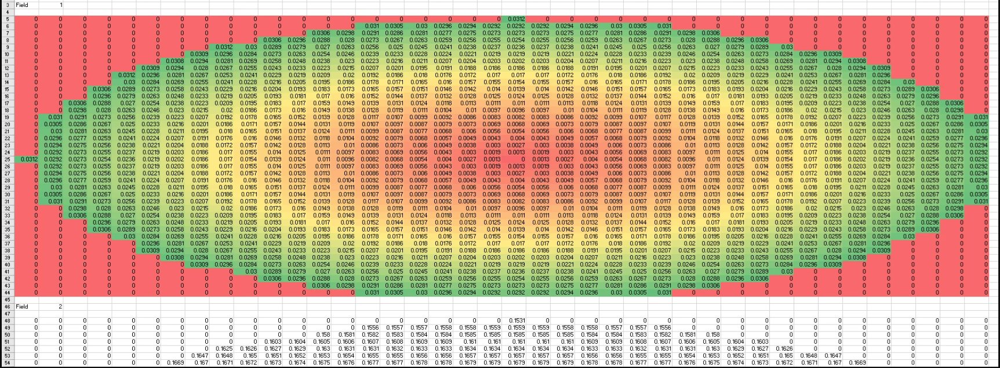

# ZPL Macro: Read optimization operand across pupil

## Overview

                                        Output of the macro with some additional post-processing in Excel

This macro may be used as a basis for gathering field-by-field ray data in equal steps across the pupil. In this macro, the angle of incidence on a surface is reported but the operand may be changed to any that uses normalized ray coordinates. 

## Author

Alexandra Culler

## Language
ZPL

## Download
<table>

<tr>

<th>Date</th>

<th>Version</th>

<th>OpticStudio Version</th>

<th>Comment</th>

<tr>

<tr>
<td>2019/12/10</td>

<td>1.0</td>

<td>19.8</td>

<td>Creation<td>
<tr>
<td>2020/09/20</td>

<td>1.1</td>

<td>20.2</td>

<td>Updates for OpticsTalk+Envision 
Cleaning up the output. Additionally, a reformatted version has been made available which splits the calculation into child/parents macros.
<tr>

