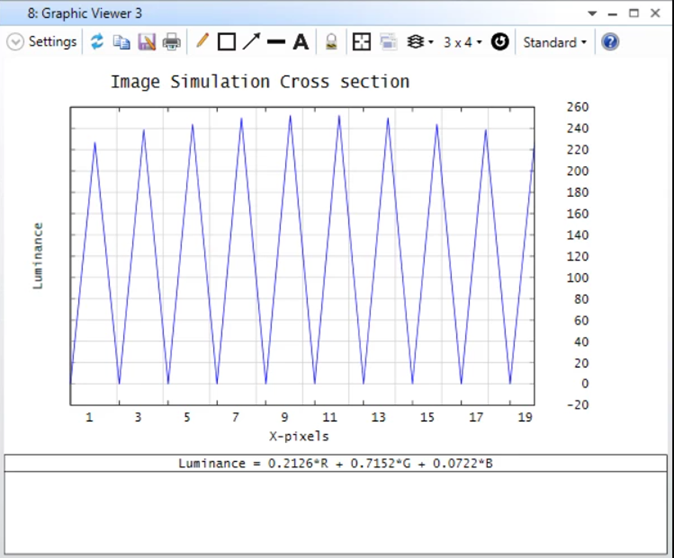

# ZPL Macro: Sequential - Image Simulation Cross Section

## Overview

This macro reads the text output of the image simulation.  The text output contains the RGB values of the image for each pixel. It then creates a cross section of the image simulation in X or Y for a defined X or Y pixel.

In the Image Simulation window, click on Save first before running it

## Author

Sandrine Auriol

## Language
ZPL

## Download
<table>

<tr>

<th>Date</th>

<th>Version</th>

<th>OpticStudio Version</th>

<th>Comment</th>

<tr>

<tr>
<td>2021/12/09</td>

<td>1.0</td>

<td> - </td>

<td>Creation<td>
<tr>

