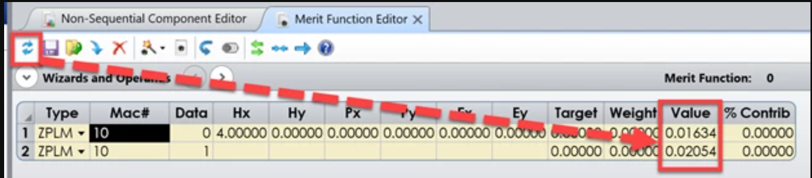

# ZPL Operand Extract FWHM from non-sequential detector

## Overview

This macro will calculate the approximate FWHM of a near-Normal distribution of data. This macro assumes symmetry about the maximum value and assumes a minimal amount of noise between 0 and the maximum. The macro will update the Detector Viewer settings to a cross-section view. Then, the data will be extracted and evaluated. When using the ZPL10 version of the macro, the approximate FWHM will be reported when Data = 0 for the X-direction, and Data = 1 for the Y-Direction. Use the Hx entry to specify the detector of interest.

## Author
Alexandra Culler

## Language
ZPL

## Updated
10/22/2021 - Stability and calculation updates. The calculation is now more robust. The code for finding the CFG file has been updated. See the ReadMe for more information. 

## Download
<table>

<tr>

<th>Date</th>

<th>Version</th>

<th>OpticStudio Version</th>

<th>Comment</th>

<tr>

<tr>
<td>2019/10/15</td>

<td>1.0</td>

<td>19.4SP2</td>

<td>Creation<td>
<tr>
<td>2020/10/14</td>

<td>2.0</td>

<td>20.3</td>

<td> Updated macro with the following 
- CFG is programmatically calculated 
- FWHM index location updated to match Excel LOOKUP function 
- FWHM index location calculation repaired to check for +/- index value location
<tr>
<td>2021/10/22</td>

<td>3.0</td>

<td>21.3</td>

<td> Updated macro with the following 
- CFG filename search has been updated. The previous method searched for any CFG file. The new method will search for the file-specific CFG file. This is useful if the lens file is stored in the same directory as others. 
-  The calculation has been updated. Previously, the calculation assumed perfect symmetry of the array of data. This caused the calculation to fail if the distribution was not centered on the detector. Now, the HWHM is calculated for one side and doubled. 
- The FWHM calculation is now more robust, finding the exact location of the half max instead of using the closest available location in the array of intensity data.
