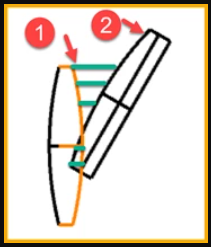
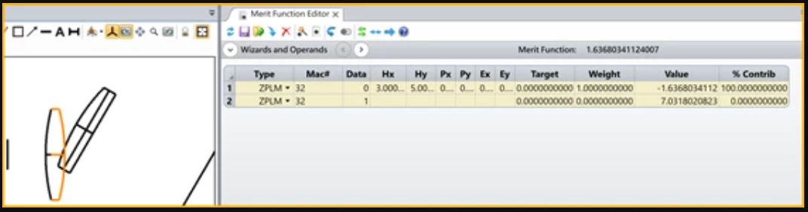
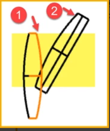

# ZPL Operand: Get the minimum distance between two surfaces with coordinate break

## Overview

In the optimization process, we usually have to set a suitable space between two lenses to avoid overlapping lenses. However, the current merit function operands don’t support the lenses with coordinate break. A possible solution is to use ZPLM to get the minimum distance between two surfaces with coordinate break.

## Author
Yihua Hsiao

## Language Used
ZPL

## Instructions

#### 1. How to use
1. The parameter Hx: the surface number of surface  ①.

2. The parameter Hy: the surface number of surface ②.

3. Data=0: Get the minimum distance between two surfaces along the surface ① local z axis.

4. Data=1: Get the maximum distance between two surfaces along the surface ① local z axis.

#### Limitation of this ZPLM:

1. The minimum distance between two surfaces means the distance is along the surface ① local z axis. In the code, the reference of global coordinate surface is temporary set as the surface ①, and then restore to the original setting after calculation.

2. Only the yellow overlapping area in the figure below will be considered, beyond the range will not be considered. In the range, 100 points are taken to calculate the horizontal distance, and then the maximum and minimum values are found.

3. Ray tracing is used in the code. Therefore, it is necessary to ensure that there is no change in refractive index between the two surfaces.

   If your system has a change in refractive index between two surfaces, you can add in the code to change all materials to air, then perform ray tracing, and then restore the materials to their original settings after the calculation.

4. The code is considered in the yz plane with x=0, that is, rotation along the z-axis, rotation along the y-axis, and decenter along the x-axis are not considered. If you need more complex transformations, you need to change the code by yourself

5. This example is for reference only. Large rotation angles may cause calculation errors, please verify that the calculated values are correct before use.

   <table>

   <tr>

   <th>Date</th>

   <th>Version</th>

   <th>OpticStudio Version</th>

   <th>Comment</th>

   <tr>

   <tr>
   <td>2019/01/01</td>

   <td>1.0</td>

   <td> - </td>

   <td>Creation<td>
   <tr>