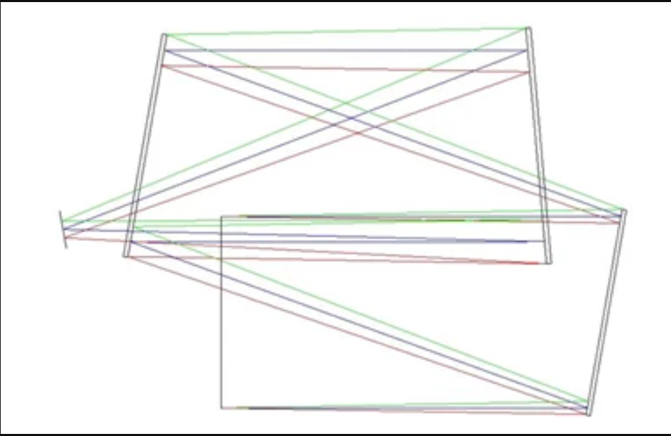
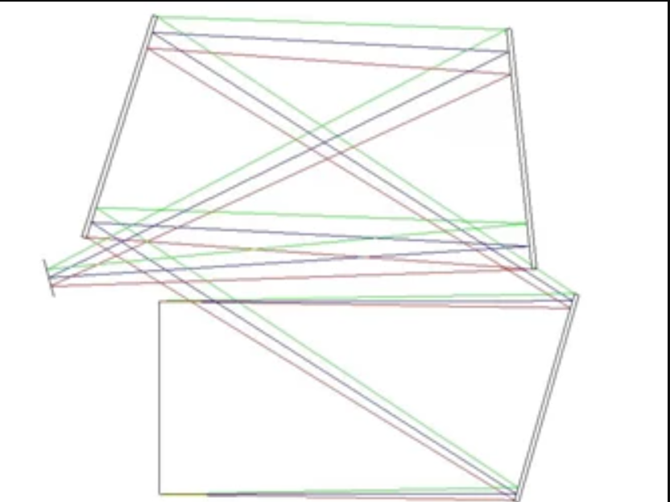

# ZPL Operand: Optimize without vignetting TMA systems

## Overview

The ZPL actually checks that a surface does not vignette a ray in sequential mode. In sequential mode, a ray only knows about the next (n+1) surface that it's travelling to...the ray doesn't know about previous surfaces or surfaces beyond the next surface. Therefore, you can have surfaces other than n+1 which can clip the ray in real life but SEQ won't detect that.

The macro traces a specific marginal ray (±x or ±y) and targets the Mechanical Semi-Diameter of a specific surface. The ZPLM then forces a minimum clearance distance between between the edge of the mirror and the specified marginal ray.

## Author
Alexandra Culler

## Language
ZPL

## Note
The ZPLM has been written with circular apertures in mind. For systems with other aperture types, the code will need to be updated. 

## Additional note
This macro has not been rigorously tested, which is why it is not yet on the Code Exchange. We cannot guarantee the results, but it will be a good starting point for situations like these. 
