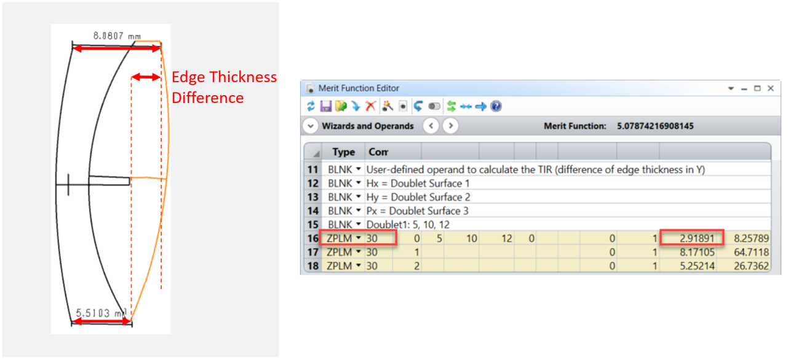
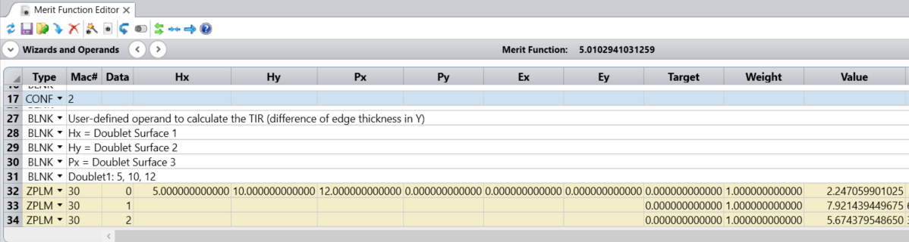
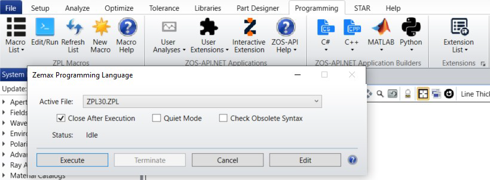
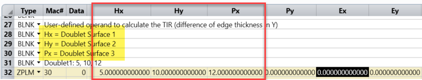

# ZPL Operand Edge Thickness Doublet

## Overview

This ZPL operand (ZPL30) computes the top and bottom edge thickness of a Doublet at the Semi-Diameter. It also computes the difference. By default, OpticStudio measures the edge thickness at the lens semi-diameter or mechanical semi-diameter.

## Author
Sandrine Auriol

## Instructions

#### 1. Installation
Copy the macro to the \Documents\Zemax\Macros folder.

#### 2. How to use
To use the Zemax User plugin, open a file that contains a doublet. For example, open the file Plossl_Example_Tolerance.zar that is in the reposatory.
This file contains 2 configurations:
- Configuration 1: nominal configuration
- Configuration 2: eyepiece with tolerances
Open the merit function:

The ZPL30 operand is calculating:
Data = 0: the doublet TIR at the doublet semi-diameter, so the difference between the doublet Top Edge thickness and the doublet bottom edge thickness
    
    Data = 1: the doublet Top Edge thickness
    Data = 2: the doublet bottom edge thickness

The calculation can be seen by opening the ZPL Macro:

The user defined operand ZPL30 Takes two Arguments

    Hx: is the 1st argument. It is the 1st surface of the doublet.
    Hy: is the 2nd argument. It is the 2nd surface of the doublet.
    Px: is the 3rd argument. It is the 3rd surface of the doublet.
Then the different steps of the calculation are:

    • Change the Global Coordinate Reference Surface to Doublet_Surf1.
    • Convert the coordinates of Edge Point1 (x1,y1) to local coordinate system of Surf3
    • Calculate z3local with the numeric function SAGG(x,y,Surface)
    • x3local,y3local,z3local are the local coordinates of Edge Point 3
    • Convert the local coordinates of Edge Point3 (x3local,y3local,z3local) to global coordinates
    • Edge Thickness Top = z3global – z1global
    • Repeat the same for the Bottom Edge points
    • Edge Thickness Difference = Edge Thickness Top - Edge Thickness Bottom
